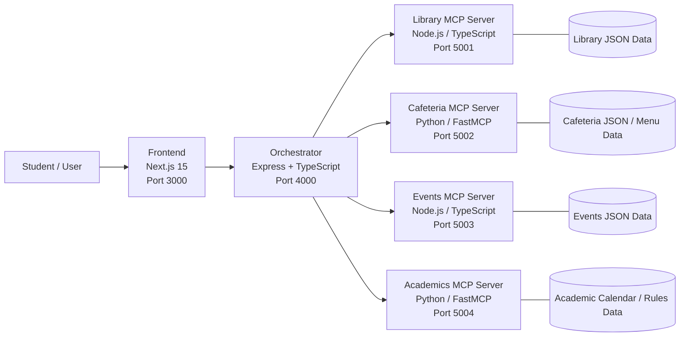

# 🎓 Campus Pulse — Unified Campus Intelligence Dashboard

A unified campus intelligence dashboard for IIT Roorkee that combines a modern Next.js frontend, an Express-based orchestrator, and independent MCP servers for library, cafeteria, events, and academics. The AI assistant routes user questions to the right campus source in real time and streams the answer back to the browser.

   

---

## Deployment

### Frontend

**Deployment URL:**  
[Campus Pulse Dashboard](https://campus-intelligence-dashboard-wit-git-ff24fc-ask-elads-projects.vercel.app/)

### Orchestrator

**Deployment URL:**  
[Campus Intelligence Orchestrator](https://campus-intelligence-dashboard-with-ai-ka6v.onrender.com)

#### MCP Servers

- **Library MCP Server:**  
  https://campus-intelligence-dashboard-with-ai.onrender.com

- **Events MCP Server:**  
  https://campus-intelligence-dashboard-with-ai-wyzl.onrender.com

- **Cafeteria MCP Server:**  
  https://campus-intelligence-dashboard-with-ai-f5nb.onrender.com

- **Academics MCP Server:**  
  https://campus-intelligence-dashboard-with-ai-3b5w.onrender.com

### Demo Video

**Video URL:** - https://drive.google.com/drive/u/0/folders/1RNVrBXbbFOY0wRM0fAylkNWPNnqcO23g


 ---

## Overview

Campus Pulse is designed around the idea that campus data should stay close to the source. Instead of merging everything into one large database, each campus domain is served by its own MCP server. The orchestrator connects to those servers, discovers available tools, and decides which server(s) to query based on the student’s request.

The result is a single dashboard where students can:

* check library availability and borrowing status,
* view cafeteria menus and eateries,
* browse upcoming campus events and festivals,
* inspect academic calendar entries, holidays, and rules,
* chat naturally with an AI assistant that can use live campus tools.

---

## Architecture



### Request flow

1. The student opens the frontend in the browser.
2. The frontend calls Next.js API routes or the orchestrator’s chat endpoint.
3. The orchestrator initializes MCP client connections and discovers tools.
4. The AI agent selects the right tool(s) for the request.
5. The relevant MCP server returns live structured data.
6. The orchestrator streams the final response back to the frontend using SSE.

---

## Features

### Dashboard

* Library widget for catalog search, availability, and borrowed books
* Cafeteria widget for daily menu, weekly menu, and campus eateries
* Events widget for upcoming club events and annual festivals
* Academics widget for calendar, holidays, and campus rules
* Server health indicators with latency in the sidebar

### AI Assistant

* Natural-language chat powered by Groq Llama 3.3
* Tool routing across multiple MCP servers
* Live tool-call tracing in the UI
* Streaming responses over SSE
* Student profile injection for personalized answers

### Project Design

* Separate MCP server for each campus domain
* No single monolithic database
* Data fetched live from source servers
* Clear separation between UI, orchestration, and data services

---

## Tech Stack

| Layer                | Technology                      |
| -------------------- | ------------------------------- |
| Frontend             | Next.js 15, React, TypeScript   |
| Styling              | CSS variables + Tailwind CSS v4 |
| Orchestrator         | Node.js, Express, TypeScript    |
| MCP Servers (Node)   | `@modelcontextprotocol/sdk`     |
| MCP Servers (Python) | FastMCP                         |
| LLM                  | Groq API (Llama 3.3)            |
| Icons                | lucide-react                    |

---

## Repository Structure

```text
campus-intelligence/
├── frontend/
│   └── app/
│       ├── page.tsx              # Dashboard
│       ├── assistant/page.tsx    # AI assistant
│       ├── api/                  # Next.js proxy routes
│       ├── context/              # App state/context
│       └── globals.css           # Global styling and layout
├── orchestrator/
│   └── src/
│       ├── server.ts             # Express server + API routes
│       ├── healthcheck.ts        # MCP health loop
│       ├── llm/provider.ts       # Groq integration
│       ├── mcpClients/manager.ts # MCP client connections
│       └── router/agent.ts       # Tool routing and agent loop
└── mcp-servers/
    ├── library-server/           # Node.js/TypeScript MCP server
    ├── events-server/            # Node.js/TypeScript MCP server
    ├── cafeteria-server/         # Python MCP server
    └── academics-server/         # Python MCP server
```

---

## Prerequisites

| Tool         | Minimum Version |
| ------------ | --------------- |
| Node.js      | 18.x            |
| npm          | 9.x             |
| Python       | 3.10+           |
| pip          | 22+             |
| Groq API key | Required        |

---

## Setup Instructions

### 1) Configure environment

Copy the example environment file into the orchestrator folder:

```bash
cp .env.example orchestrator/.env
```

Then open `orchestrator/.env` and set your Groq key:

```bash
GROQ_API_KEY=your_key_here
```

### 2) Install dependencies

```bash
npm install --prefix orchestrator
npm install --prefix mcp-servers/library-server
npm install --prefix mcp-servers/events-server
pip install -r mcp-servers/cafeteria-server/requirements.txt
pip install -r mcp-servers/academics-server/requirements.txt
npm install --prefix frontend
```

### 3) Build TypeScript packages

```bash
npm run build --prefix mcp-servers/library-server
npm run build --prefix mcp-servers/events-server
npm run build --prefix orchestrator
```

### 4) Start all services

Run each service in its own terminal:

**Terminal 1 — Library MCP server**

```bash
cd mcp-servers/library-server && npm start
```

**Terminal 2 — Events MCP server**

```bash
cd mcp-servers/events-server && npm start
```

**Terminal 3 — Cafeteria MCP server**

```bash
cd mcp-servers/cafeteria-server && python main.py
```

**Terminal 4 — Academics MCP server**

```bash
cd mcp-servers/academics-server && python main.py
```

**Terminal 5 — Orchestrator**

```bash
cd orchestrator && npm start
```

**Terminal 6 — Frontend**

```bash
cd frontend && npm run dev
```

### 5) Open the app

Visit:

```bash
http://localhost:3000
```

---

## MCP Tools Reference

### Library (`5001`)

* `search_books` — fuzzy search by title, author, or call number
* `get_book_by_id` — detailed book information
* `get_library_hours` — MGCL opening hours and holiday policy
* `get_library_info` — library facts, rules, and features
* `get_borrowed_books` — borrowed books for a student ID

### Cafeteria (`5002`)

* `get_today_menu` — today’s breakfast, lunch, and dinner
* `get_menu_by_day` — menu for a specific day
* `get_weekly_menu` — weekly meal plan
* `get_eateries` — list of campus eateries
* `get_mess_timings` — standard meal timings

### Events (`5003`)

* `get_upcoming_club_events` — events within a chosen time window
* `get_all_club_events` — complete club event list
* `get_fests` — annual festival overview
* `search_events` — keyword search across all events
* `get_events_by_club` — events for a specific club
* `get_fest_details` — full details for a named fest

### Academics (`5004`)

* `get_academic_calendar` — academic calendar entries
* `get_upcoming_academic_events` — upcoming academic events
* `get_holidays` — gazetted holidays and countdowns
* `get_branch_cutoffs` — branch change CPI cutoffs
* `search_handbook` — handbook and policy search
* `get_acads_basics` — grading, credits, and attendance basics
* `get_all_rules` — academic rules and policies

---

## Demo Flow

1. Open the dashboard.
2. Show the four MCP server status indicators.
3. Ask a library question such as “Is the library open now?”
4. Ask for today’s cafeteria menu.
5. Ask about upcoming events or festivals.
6. Ask about holidays or academic rules.
7. Open the AI assistant and show live tool calls in the conversation.

---

## Troubleshooting

### MCP server not connected

Check that the relevant server is running on its expected port:

* Library: `5001`
* Cafeteria: `5002`
* Events: `5003`
* Academics: `5004`

### Groq rate limit error

If the assistant returns a `429`, the model has hit the token-per-minute limit. Try a smaller model or reduce the prompt/tool payload size.

### SSE connection issues

If you change the TypeScript MCP servers, rebuild them before starting:

```bash
npm run build --prefix mcp-servers/library-server
npm run build --prefix mcp-servers/events-server
```

### Frontend shows `503`

The orchestrator is offline, or one of the required services is down.

---

## Notes

* The project is intentionally modular so each campus source can evolve independently.
* The orchestrator is the only MCP client.
* The frontend uses proxy routes to keep browser requests simple and avoid CORS issues.
* Library and Events are implemented in TypeScript; Cafeteria and Academics are Python services.

---
